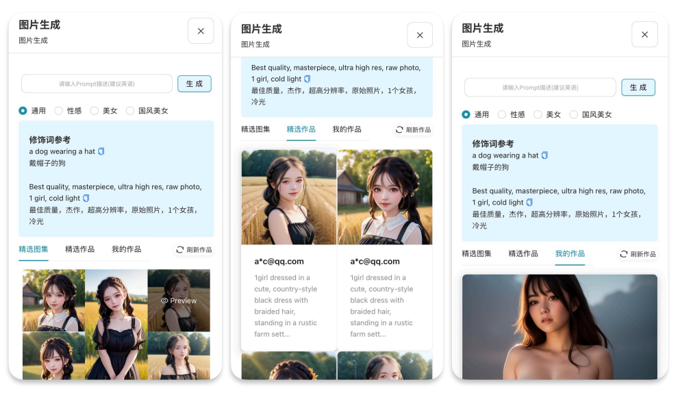
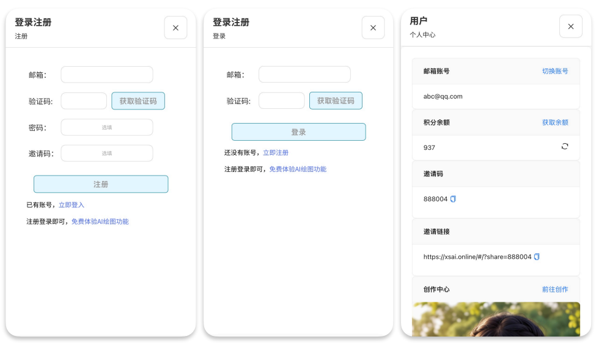

<h1 align="center">ChatGPT SDImg Web</h1>

集成部署ChatGPT+SD webUI绘图网页应用。

[演示](https://xsai.online/) / [反馈](https://github.com/chengxs1994/ChatGPT-SDImg-Web/issues)

## 效果展示

## 主要功能

- ChatGPT问答
- SD webUI AI绘画
- 用户注册登录，个人中心
- 次数限制，积分充值
- 邀请码，邀请链接分享
- 持续更新，感谢Star。如需定制，欢迎联系

## 开源计划

- [x] ChatGPT问答 大佬项目已实现 [ChatGPT-Next-Web](https://github.com/Yidadaa/ChatGPT-Next-Web)
- [x] SD webUI AI绘画 [demo已实现](https://www.xsai.online/#/img)
- [x] 用户注册登录 [demo已实现](https://www.xsai.online/#/login)
- [x] 个人中心，次数限制，积分充值 [demo已实现](https://www.xsai.online/#/user)
- [x] 邀请码，邀请链接分享 [demo已实现](https://www.xsai.online/#/user)
- [ ] AI视频生成
- [ ] 调用其他平台api

### 本地开发

1. 安装 nodejs 18 和 yarn，具体细节请询问 ChatGPT；
2. 执行 `yarn install && yarn dev` 即可。⚠️ 注意：此命令仅用于本地开发，不要用于部署！
3. 如果你想本地部署，请使用 `yarn install && yarn start` 命令，你可以配合 pm2 来守护进程，防止被杀死，详情询问 ChatGPT。

## 加入我们

## 最后

### 方便的话，帮忙给项目一个宝贵的star哈，谢谢啦
